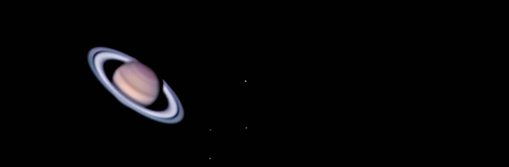

# planetary-scripts
A set of scripts to automate the processing of planetary data

-----------------------------

-----------------------------

### Field Rotation

Images from telescopes on Alt-Az mounts suffer from field rotation which causes planetary animations to have non-linear rotations. This occurs
due the the horizontal and vertical degrees of freedom of Alt-Az mounts coupling with a rotating, spherical sky.

